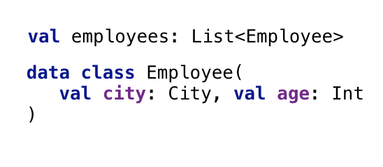

<span class="text-danger">이 리뷰는 Coursera "kotlin for java developers"을 보고 리뷰하는 포스트입니다.</span>

## 현재까지의 느낀 점

정말 강의 자체는 구성을 잘해놨다라는 느낌이 든다.
Coursera를 처음 써보는 것인데 중간 중간에 문제도 있고, 플레이그라운드라는 실습과제와 IntelliJ의 플러그인 덕분에 계속 해볼 수 있어서 좋았다.
하지만 강의가 더 많은 지식을 요구할수록 번역의 퀄리티가 더더욱 하락하여 권하기는 아쉽다.

## 목차

- 무효화 가능성
- 기능적 프로그래밍

---

## 무효화 가능성(Nullablity)

해당 장에서는 Kotlin의 Nullability의 대해서 나온다.
kotlin은 컴파일시에 null에 대해서 잡고, null에 대해서 접근할때는 다음과 같이 한다.

```kotlin
var s: String?
val length: Int = s?.length ?: 0
```

위처럼 nullable한 객체는 ?. 체이닝으로 안전하게 null이 되도록 하고 ?: 엘비스 연산자로 null일때의 액션을 정하면 not null인 영역으로 바꿀 수 있다.

### 안전한 캐스트

```kotlin
val s = if(a is String) a else null
val s: String? = any as? String
```

위처럼 진행한다면, 캐스팅을 안전하게 해당 타입이면 String, 아니면 null로서 캐스팅이 가능하다. 위의 nullable 연산자 캐스팅과 같이 쓰면 효과적으로 컴파일 시 방어가 가능하다.

<!--more-->

---

## 기능적 프로그래밍 (Functional Programming)

코틀린읜 다중개념을 지원하는 언어다. 그중에서 FP를 지원하는 쪽을 보자. 여기서 FP란 무언가란 설명하지 않겠다.

### 람다

람다는 다음과 같이 쓴다.

```kotlin
list.any { i -> i > 0}
list.any {it > 0}
list.any {
  println("processing $it")
  it > 0
}
```

람다는 람다가 마지막 argument일때, 생략이 가능하다. 또한 it이라는 축약어를 통해서 i -> i > 0 과 같은 의미없는 할당을 줄였다. 또한 destrucuring이 지원되어 Map밸류를 필터링 할 때 좋을 것 같다.

### Common operations

다음과 같은 구조가 있다고 생각해보자


```kotlin
// filter: 나이가 홀수인 직원만 뽑기
employees.filter {it.age % 2 == 0}
// map: city를 문자열로 만들기
employees.map {"$it.city"}
// any: 하나라도 만족하면 true (all: 모든 이터러블이 조건을 만족했을때 true, none: 모든 이터러블이 조건을 만족하지 않을때 true)
employees.any {it.age % 2 == 0} // true/false return
```

이렇게 기본적인 것들을 사용할 수 있다. 나머지는 문서를 직접 보자.

### Function Type

```kotlin
val sum = {x:Int,y:Int -> x+y}
val sum = (Int,Int) -> Int = {x,y -> x+y}
```

위는 똑같은 함수를 나타내는 방법이다. lambda를 나타낼때 처럼, ->로서 파라미터와 리턴값을 구분한다.
저장된 함수는 자바처럼 apply같은 명령어가 필요없이 바로 ()통해 evaluation할 수 있다.

```kotlin
{println("Hello Run!")}()
run {
  println("Hello Run!")
}
```

이렇게 람다를 IIFE(즉시실행함수)처럼 사용할 수 있지만, run을 명시하는 것이 더욱 코틀린스럽다.

### member reference

람다가 들어갈 곳엔 reference를 그대로 쓸 수 있다.

```kotlin
class Person(val name: String, val age: Int)
people.maxBy{it.age}
people.maxBy(Person::age)
```

kotlin은 it을 쓸 수 있지만, 다음처럼 레퍼런스를 사용하여 더욱 집적도를 높일 수 있다.

또한 이는 파일에서도 가능하다.

```kotlin
fun isEven(i: Int): Boolean = i % 2 == 0
list.any(::isEven)
```

클래스 내부에서 쓸 때는 다음처럼 써야한다.

```kotlin
class Person(val name: String, val age: Int) {
  fun isOlder(ageLimit: Int) = age > ageLimit
  fun getAgePredicate() = ::isOlder
}
```

이렇게 같은 파일 내부에서는 this를 제외하고 해당 멤버변수의 레퍼런스를 적으면 된다.

### return from lambda

```kotlin
fun duplicateNonZero(list: List<Int>): List<Int> {
 return list.flatMap {
 if (it == 0) return listOf()
 listOf(it, it)
 }
}
println(duplicateNonZero(listOf(3, 0, 5)))
```

이러한 코드에서 결과 값이 어떻게 될까?
**결과는 바로 []이다.**
lambda에서는 return이 있다면, 별도로 표기하지 않는한 위의 함수가 리턴이 된다.
즉 0을 만나자 마자 람다의 컨텍스트가 끝나는 것이 아니라, 함수의 컨텍스트가 끝나는 것이다. 이러한 것을 막기 위해선 람다에서 return을 하지 않거나 다음과 같은 방법이 가능하다.

```kotlin
fun duplicateNonZero(list: List<Int>): List<Int> {
 return list.flatMap {
 if (it == 0) return@flatMap listOf()
 listOf(it, it)
 }
}
println(duplicateNonZero(listOf(3, 0, 5)))
```

다른 방법도 있지만 사실 lambda에서 return자체를 안하는 것이 에러를 줄이는 방법일 것 같다.
