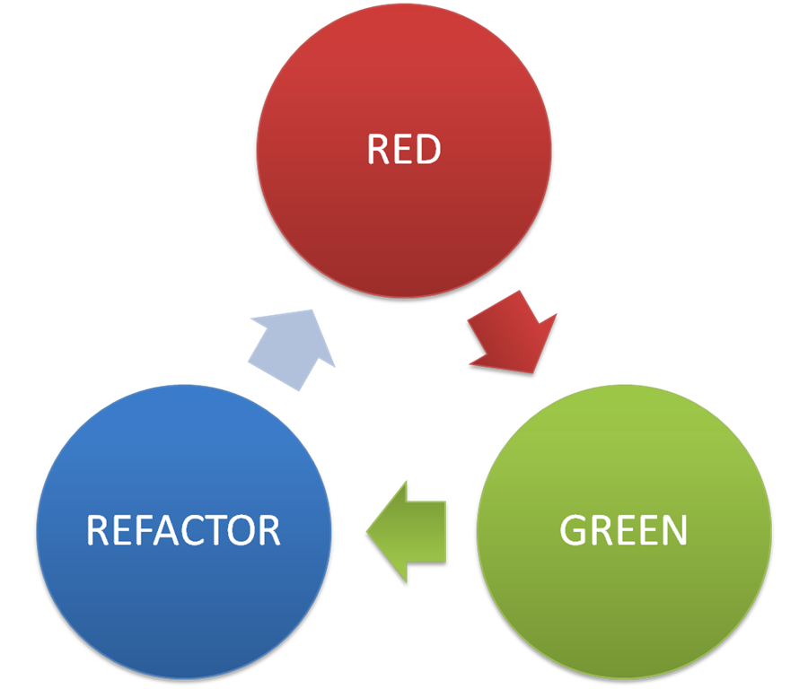

프로그래머라면 다들 그런다. 자신의 코드에 책임을 질 수있어야 한다고.
하지만 그 전에 자신의 코드가 제대로 작성되는지도 확신 할 수가 없다면 어떻게 책임을 질 수 있을까?

사실 나는 내 코드가 제대로 작성이 되는지 엄청나게 불안해 한다. 하지만 제대로 확인을 못하는 게 다수다.
그래서 적어도 앞으로 이정도는 확신을 할 수 있는 코드를 만들고 싶었다.
또한 회사에서도 다들 잘 이용하시기에 제대로 배워보고 싶어 Testing과 Mockito를 공부하게 되었다.

---

## Testing

내가 생각하는 테스팅의 장점은 다음과 같다.

1. 해당 코드의 화이트 박스
2. 변화에 방어할 수 있는 방어막
3. 코드를 설명해 주는 가이드라인
4. 설계 문서

<!--more-->

먼저 차근차근 하나씩 하나씩 설명해 보자.
처음으로 **화이트 박스**이다. 적어도 내 코드가 테스트 코드를 작성한 대로 동작을 함을 확신 할 수 있다.
이에 의구심을 가지는 사람은 없으리라 생각된다.

두번째로는 **방어막**이다. 서비스의 특성상 어떠한 서비스던 변화를 맞이한다. 그리고 서비스의 코드를 짜는 사람은 해당 코드를 완벽히 이해한다고 보기 힘들다. 그렇기에 작은 실수가 일어날 수 있다.
이때 배포 전에 간단하게 젠킨스와 같은 CI를 두어 테스트를 전에 돌린다면 어느정도의 방어막을 둘 수 있는 것이다.

세번째로는 **가이드라인**이다. 테스트란 어떠한 코드가 어떠하게 동작을 해야하는지 기술되어 있는 코드이다. 그러다 보니 이러한 인풋에는 이러한 아웃풋이 나온다는 것을 그리 어렵지 않게 알 수 있다. 그리고 이렇게 되어 있는 것으로 코드에는 작성되 있지 않은 개발자의 의도 또한 알 수 있는 경우도 있다.

마지막은 **설계 문서**이다. 테스트 코드를 짜는 사람들중 일부는 테스트를 먼저 짜서 코드가 어떤 식으로 동작할 지 미리 결정을 해놓고 나중에 구현을 하는 경우가 있다. 나도 이렇게 한번 짜봤는데 생각외로 놓치는 부분없이 깔끔한 코드가 한번에 나오는 경험을 하였다. 엣지 케이스에 대해서 조금 더 빠르게 반응 할 수 있어 너무나 좋았다.

---

## Testing Library

자바스크립트는 모카, 제스트와 같은 것으로 테스트를 하고 스프링을 쓰는 사람은 JUnit, Mockito, Spock등을 사용하여 테스팅을 진행한다.
나는 백엔드 개발자여서 해당 부분에 대해서 JUnit과 Mockito를 기반으로 테스트를 진행 하였다.

JUnit은 테스트 환경을 제공해준다. 그래서 필수적으로 사용하였다.
그리고 가장 좋아하는 부분은 바로 Mockito이다. 이 Mockito를 사용한다고 하면 정말 환상적으로 단위테스트를 진행할 수 있다.

### Mockito란?

먼저 유닛 테스트는 해당 코드(보통 한 클래스의 메소드들)을 확인을 하기위함이다. 그러기에 이외의 종속성에 자유로워야하는데 그것을 보장하기 위해 Mockito를 사용한다.
이 Mockito를 사용하면 Mock을 주입할 수 가 있다. 또한 이 Mock을 원하는 대로 설정이 가능하다. 밑에 예시 코드를 두었다. 이 예시 코드를 보면서 해보자.

```kotlin
/* TARGET CODE */
class PageInfoCardRepository(val pageInfoJpaRepository: PageInfoJpaRepository) {
.
.
.
  fun getPageNumbers(): Int = pageInfoJpaRepository.findAll().size
}
```

위가 테스트를 할 코드고 굉장히 간단하게 테스트용으로 함수를 만들었다.

```kotlin
/* TEST CODE */
private val pageInfoJpaRepository: PageInfoJpaRepository = mock(PageInfoJpaRepository::class.java)
private val pageInfoCardRepository: PageInfoCardRepository = PageInfoCardRepository(pageInfoJpaRepository)
.
.
.
whenever(pageInfoJpaRepository.findAll()).thenReturn(mockList)
assertEquals(pageInfoCardRepository.getPageNumbers(), mockList.size)
```

이해를 돕기 위해 코드를 가져왔다. 위의 코드는 코틀린이다.
이렇게 whenever(자바는 when)으로 원하는 mock 객체에 원하는 응답을 집어넣는다. 이렇게 한다면 해당 객체를 불러오는 메소드들은 mock에 세팅된 값을 받아 정말 해당 클래스의 있는 코드만 확인 할 수 있는 것이다. 그리고 이것 뿐만이 아니다.

```java
verify(notifier, never()).notifyOnFail(anyString(), anyLong(), any(Exception.class));
verify(notifier, atLeastOnce()).notify(anyString(), anyLong());
verify(notifier, times(2)).notifyToKafka(anyString(), anyLong());
```

이렇게 위에서 이런식으로 해당 코드가 실행이 되었는지 안되었는지 또한 확인이 가능하다. 이렇게 단위테스트를 함으로서 해당 클래스의 검증을 손쉽게 할 수 있다.

---

## 테스트 작성법

그럼 위에 코드를 사용해 코드를 작성을 할 수 있다고 치자. 그렇게 하더라도 아직 막막하다. 테스트를 어떻게 짜야할지 막막하기 때문이다.

먼저 나는 줄 조건들을 나열한다. 그리고 그 상태는 보통 "어떠한 값이 INPUT으로 들어가는 가이다."
그리고 이렇게 조건들마다 어떤 한 상태로 마무리 될지 확인한다. 그렇게 메소드 명을 정한다.

```
fun orderProduct__돈이_부족할때__Exception발생() {
  .
  .
  .
}
```

이렇게 내가 작성할 수 있는 INPUT과 그에 따른 OUTPUT을 마무리지어 놓는다. 그리고 이제 테스트를 작성을 한다.
테스트를 작성할 때 가장 유명한 방법 **GIVEN - WHEN - THEN**으로 작성을 한다.

1. GIVEN - 어떠한 값을 주어줄지 정한다. 여기서는 그 조건에 맞는 값 세팅이다. 더 구체적으로 말하자면 Mockito의 when이 들어가야한다.
2. WHEN - 실제로 그 코드를 동작시킨다.
3. THEN - 그 코드가 어떠한 행동을 했을지 서술해놓는다. 구체적으로 말하자면 AssertThat, Verify 등이 여기에 속한다.

이렇게 테스트를 한다면 유닛테스트는 성공적으로 마칠 수 있다.

---

### Controller Test

위의 과정을 따라하였다면 어느정도의 비즈니스 로직은 커버가 가능할 것이다. 하지만 이외로 확인하기 어려운 것이 난 컨트롤러 테스트라고 생각한다.
컨트롤러 테스트는 유닛테스트는 아니고 굳이 따지자면 약간의 Integration Test라고도 할 수 있다.

한번 일반적인 JSON - API서버의 테스트 코드를 살펴보자

```java
  //GIVEN
  val mockList = makeMockPageInfoList()
  whenever(pageInfoCardRepository.getCardsByPage(1)).thenReturn(mockList)

  //WHEN
  val response = MockMvcBuilders.standaloneSetup(controller).build().perform(get("/pages/1"))


  //THEN
  response.andExpect(status().isOk)
          .andExpect(jsonPath("$[0].name").value("name"))
          .andExpect(jsonPath("$[1].name").value("name"))
          .andExpect(jsonPath("$[0].url").value("url"))
          .andExpect(jsonPath("$[1].url").value("url"))
```

위에 GIVEN은 이해할 것이지만 WHEN과 THEN절이 이해가 안가리라 생각한다. when에서 해당 컨트롤러를 넣고 빌드를 하면 해당 서버를 작동한 것과 비슷한 상황을 만든다.
그리고 이렇게 perform을 함으로서 어떠한 값을 넣을지 보고 andExpect로 해당 값의 상태와 형태를 보고 jsonPath로 body를 검사하여 종료한다. 그렇다면 POST와 같이 body가 있는 경우는 어떨까?

```java
  //WHEN
  val mockName = "name"
  val mockUrl = "mock_url.com"
  val mockGroup = "login"
  val mockCycleTime = 4000L
  val mockPageInfoPostDto = PageInfoPostDto(mockName, mockUrl, mockCycleTime, mockGroup)
  val mockPageInfo = mockPageInfoPostDto.makePageInfo()

  val content = objectMapper.writeValueAsString(mockPageInfoPostDto)
  whenever(pageInfoJpaRepository.save(Mockito.any(PageInfo::class.java))).thenReturn(mockPageInfo)

  //GIVEN
  val response = MockMvcBuilders.standaloneSetup(controller).build().perform(
          post("/info")
                  .content(content)
                  .contentType(MediaType.APPLICATION_JSON)
                  .accept(MediaType.APPLICATION_JSON)
  )

  //THEN
  response.andExpect(status().isOk)
          .andExpect(jsonPath("$.name").value(mockName))
          .andExpect(jsonPath("$.url").value(mockUrl))
          .andExpect(jsonPath("$.cycleTime").value(mockCycleTime))
          .andExpect(jsonPath("$.pageGroup").value(mockGroup))
```

이렇게 Jackson의 오브젝트맵퍼로 시리얼라이즈를 해놓고 content로서 넣는다. 그리고 content-type과 accept는 서버에서 못받을 수도 있으니 세팅을 해준다.
이렇게 하면 Post도 훌륭하게 끝난다.

<small style="color: red;">주의점: HashCode와 Equals를 초기화 하지 않았고 mockito의 when을 any객체로 하지 않았다면 같은 내용물이어도 Deserialize되면서 새로운 객체를 생성하기에 when의 값이 정의가 되지 않아 에러를 일으킬 수 가 있다. 데이터 객체면 초기화까지 해주는 것이 좋다.</small>

---

### RED, REFACTOR, GREEN - TDD

그리고 마지막에 이걸 쓴다. 위에서 언급하다 시피 테스트는 하나의 설계문서가 될 수 있다. 하지만 우리는 모두 알고 있다. 그 어떤 바보도 집을 다 짓고 설계를 하는 바보가 없음을.
그렇기에 설계문서를 먼저 작성하는 행위를 테스트로 한다면, 테스트가 본 코드보다 앞서야 한다. 그리고 이를 체계화 시킨 것도 있다.

바로 Red - refactor - green이다.


1. 대략적으로 메소드 명과 아웃풋을 아무거나 리턴하게 한다.
2. 설계를 하고 red를 받는다.
3. refactor
4. green을 받는다.

이리 하는 것이 조금 더 테스트를 가치있게 만드는 일이고 이렇게 함으로서 설계와 테스트 모두를 강제함도 있다. 그래서 테스트에 적응 되었으면 TDD, 테스트 주도 개발을 도입해보면 어떨까?

---

### 마무리

나도 아직 익숙치 않지만 사이드 프로젝트를 통해 정리를 하고자 한다. 그리고 나중에 이 사이드 프로젝트도 같이 올릴테니 한번 궁금하다면 참고하면 좋을 것 같다.
그리고 현재 매니저님께서 한마디를 해주셨는데 기억이 남는 말이 있다.

> 방어 코드를 넣는 건 10분이면 되고 그것을 고치는, 바로잡는 것은 몇시간이 걸린다.

이 방어코드는 여기서는 맞지 않는 것 같아도 테스트 또한 일종의 방어 코드라 생각한다. 앞으로 테스팅을 더 적극적으로 도입하여 더 안정적인 코드를 짜고자 한다. 이상으로 글을 마친다.
