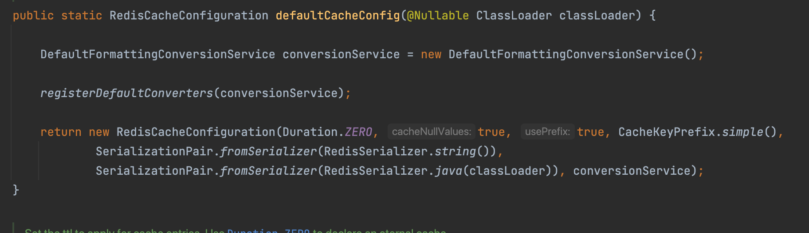
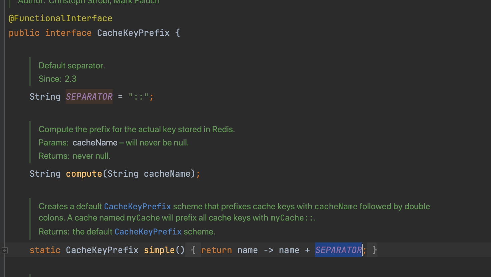
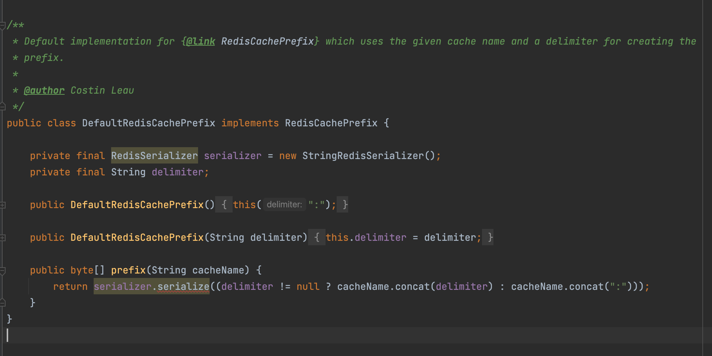
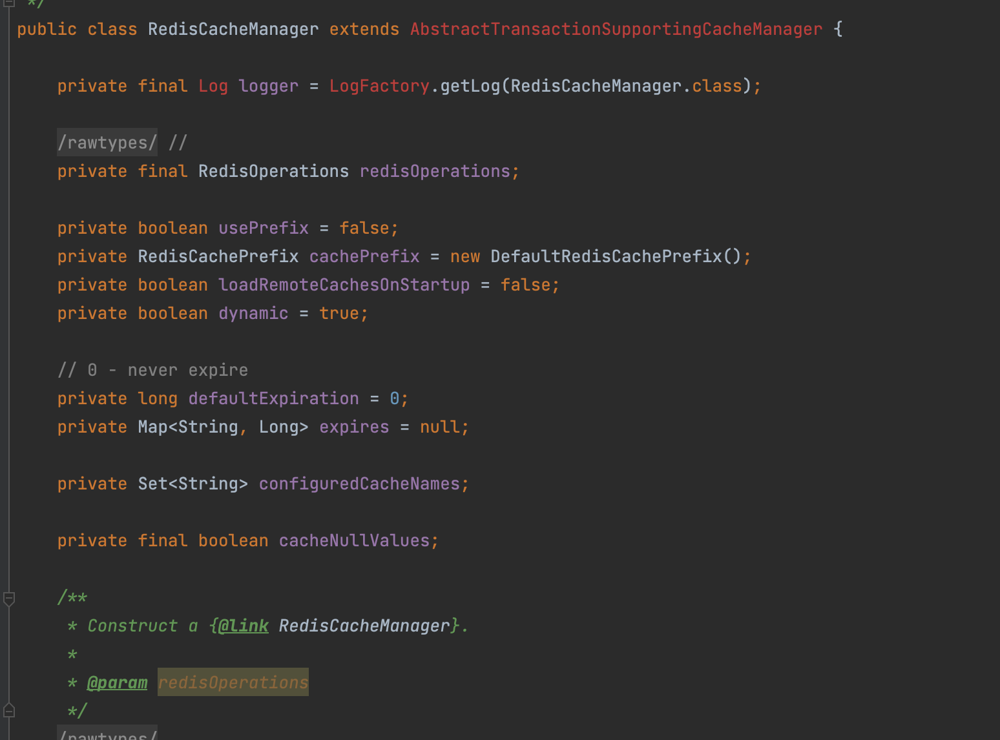
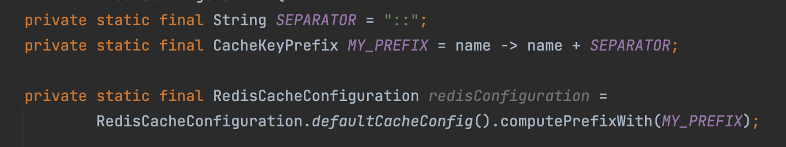

## 스프링 업그레이드, 장애로부터 살아남기

업그레이드를 하면서 발생한 1건의 장애와 2건의 장애가 날뻔한 이야기를 코드를 보면서 이야기 하고자 한다.
미래의 나와 누군가 이 블로그를 본 누군가에게 정말 큰 도움이 되었으면 한다.

먼저 업그레이드 시리즈에서 예고한 바로 그 친구, Spring data redis에 대해서 이야기 하고자 한다.

타임라인은 이렇다. 시간은 정확하지 않다!

> | Time                 | Action                                 |
> | -------------------- | -------------------------------------- |
> | ~ 2시                | 스테이지 확인                          |
> | 2시 ~ 3시            | 카나리 배포 후 JVM & Nginx 메트릭 확인 |
> | 3시 ~ 5시            | 전체 배포                              |
> | 5시 ~ 5시 30분       | 타 이슈건으로 롤백                     |
> | 5시 30분 ~ 6시       | 롤백을 롤백                            |
> | 6시 ~ 7시            | VOC를 받기 시작, 롤백                  |
> | 7시 ~ 8시 반         | 장애 분석                              |
> | 8시 반 ~ 새벽 1시 반 | 장애 복구                              |

VOC는 어떤 VOC였나면, CS툴에서 유저의 개인정보를 수정했는데도 불구하고, 개인정보가 반영이 되어있지 않은 장애였다.
원인은 <b>스프링 데이터 레디스 2의 기본 캐시키 전략 변경</b> 때문이다.

<!--more-->

## 스프링 데이터 레디스 2 캐쉬키 생성 전략

보는 것 처럼 스프링 데이터 레디스2에서는 각 키별로 RedisCacheConfiguration을 만들어 관리한다 여기서 주의 깊게 봐야할 것은 CacheKeyPrefix.simple이다.
한번 들여다 보자.

보면 기본 캐쉬 키 프리픽스가 네임 뒤에 `::` 이 붙는다. 주의하자.

그러면 스프링 데이터 레디스 1 캐쉬키를 보자.

## 스프링 데이터 레디스 1 캐쉬키 생성 전략

위와 다르게 Prefix에 `:`가 붙는다.

이미 본 김에 조금 더 보자

스프링 데이터 레디스 1은 캐쉬매니저 기반으로서 관리하며 키별로 관리하는 게 아닌 Manager별로 관리가 된다. 즉 2보다는 설정할 수 있는 폭이 좁다. 물론 키마다 다른 매니저를 쓰게할 수는 있다.

그렇다면 캐쉬 키가 다르다면 어떤 문제가 생길까?
바로 하나의 어플리케이션에 두가지의 상태가 생긴다는 것이다.

## 장애 이해: 두가지의 상태.

이해 하기 쉽게 시나리오 베이스로 하자! TTL은 하루이다.
User A는 Spring Data Redis 2 기반에서 조회 되어 캐쉬가 되었다.

> 조회된 계정 ID: 1 이름: 김개똥

이후 유저는 Spring Data Redis 1 기반에서 수정되었다. Spring Data Redis의 캐쉬가 만료됨과 동시에 새로 써진다.

> 수정된 계정 ID: 1 이름: 김갑부

그리고 다시 유저는 Spring Data Redis 2 기반에서 조회가 되었다.

> 조회된 계정 ID: 1 이름: <b>김개똥</b>

캐쉬키가 다르기에 각각 다르게 저장이 되었고, 이는 결국 장애로 귀결되었다.

## 해결책

이를 해결하기 위해서 Spring5의 기본 캐쉬키 전략을 쓰는 것이 아닌 해당 도메인만의 캐쉬 키를 쓰기로 하였다.
밑에는 간단하게 보여주기 위한 예시 코드이다. 아래처럼 직접 prefix를 바꿔주는 것이 좋다.

- 추신: 직접 코드를 살펴본 결과 Spring-data-redis 3에서는 해당 부분에 변경이 없다. 안심하자.

## Best Solution

1. 기본 캐쉬 키 전략을 쓰지말자. 자체적으로 캐쉬 키 전략을 쓰자.
2. 캐쉬 관련된 서비스는 A <-> B로 업그레이드할 버전과 교차 검증 테스트를 진행하자.
3. 캐쉬 TTL을 짧게 가져가자. 만약 캐쉬 TTL이 짧다면, 큰 장애가 나지 않는다.
4. Redis의 Key Count와 Memory, Hit Ratio를 유심히 보자. 해당 장애도 key count가 두배가 되었었으며, hit ratio가 낮아졌다.
