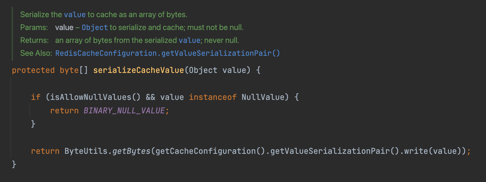
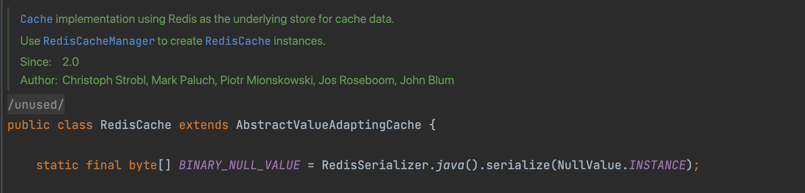
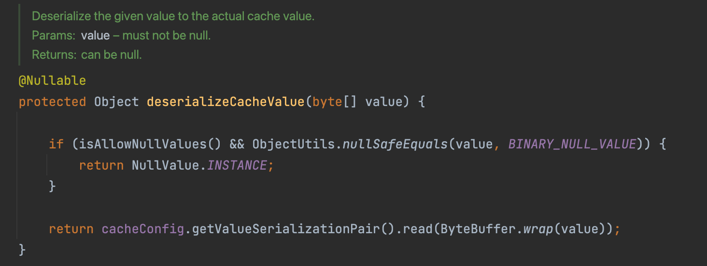

## 스프링 데이터 레디스 장애, 그 이후

> 이어지는 내용입니다. 전 포스트를 확인해주세요.
> [스프링 업그레이드, 장애로부터 살아남기 (1)](/servive-spring-upgrade-2/)

스프링 장애 이후, 빠르게 고치고 다시 나가기로 하였다. 그리고 저번 카나리때 제대로 확인이 되지 않는다는 피드백이 있었다.
그렇기에 해당 배포를 카나리를 24시간 이상 켜두기로 하였다.

그렇게 카나리를 키고 어떠한 에러로그가 눈에 띄였다.

NEW Version

> java.lang.ClassCastException: org.springframework.cache.support.NullValue cannot be cast to com.~~~~.XXXdomain.XXX

Old Version

> ERROR KryoRedisSerilizer.deserilaiize:81 - redis deserialize error: {}Encountered unregistered class ID:13394

그렇게 두번째 롤백을 하게된다....

<!--more-->

## Root Cause

원인을 알기 위해 첨언을 하자면, 우리는 불특정 다수의 트래픽을 받는 도메인으로서, 일부 해킹 공격을 막기 위해 Null을 Cache한 부분이 있다.
그리고 왜인지는 모르겠으나 기존의 Redis를 위해 KyroSerializer를 썼다.
그리고 Null을 저장하는 방식이 Spring data redis 2와 1이 달라 문제가 발생했다.

#### Spring data redis 2

Spring data redis 2의 경우 값이 Null이라면 JdkSerializationRedisSerializer로 Null을 Serialize한 값, BINARY_NULL_VALUE를 저장한다.

Deserialize 할때는 다음과 같다.

Value가 BINARY_NULL_VALUE라면, NULL로서 표현하고 아니라면 Deserialize를 시도한다.
즉 kyro로 Serialize한 NULL을 만난다면, NULL로서 인식하지 못하고, <b>해당 클래스의 서브클래스정도로 인식하기에 Cast 에러</b>가 터진다.

#### Spring data redis 1

해당 도메인 같은 경우 Serializer로 Kyro를 썼고 Spring data redis의 경우 Null을 미리 저장하는 방식이 아니다. 그렇기에 Serializer에 따라 다르다.
그렇기에 Spring Data Redis1은 2의 값을 Deserialize 못하고 <b>Deserialize 에러</b>가 난다.

## Solution

우리팀에서는 하루동안 Null이 바뀌는 경우가 없기에 캐쉬 키를 두벌을 두어 한동안 Null에 해당하는 키들을 두벌로 두었다.
즉 New 버전에서 Cache키를 업그레이드 한 것이다.

## Best Solution

1. <b>Null을 캐쉬 하지 않는다</b>
2. 만약 null을 캐쉬한다면, 일반적인 경우가 아닐 확률이 높다. 배포하는동안 캐쉬 키를 분리해서 두자.
