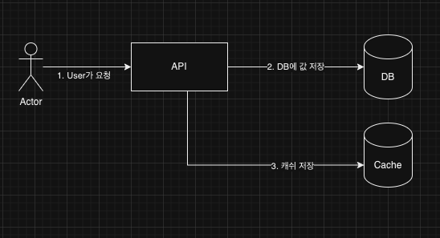

## 스프링 데이터 레디스 장애, 그 이후

> 이어지는 내용입니다. 전 포스트를 확인해주세요.
> [스프링 업그레이드, 장애로부터 살아남기 (2)](/servive-spring-upgrade-2/)

그렇게 2번째 픽스 배포 이후, 3번째 배포를 하기 시작하였다. 당연히 이번에도 하루 이상을 카나리 배포를 켜놨다.
당연히 이번에도 이상한 일이 일어났다. 바로 한 API에서 저장이 안되는 문제가 일어났다.

그렇게 세번째 롤백을 하게된다....

<!--more-->

## Context


처음 해당 API는 다른 API들과 똑같이 동작한다.

1. API의 값을 토대로 DB에 저장
2. 해당 값 Caching

기존 코드는 다음과 같은 예시를 보인다. 함부로 JPA에 변경이 있을 시, dirty check후 session flush를 하기 때문에, 클래스 내부에서 readOnly를 true로 변경한 것으로 추측된다.
변경을 원하는 코드만 @Transactional을 오버라이드하여 변경되도록 한다.

```java
@Transactional(readOnly = true)
public class XXXRepository {
  @CachePut(key = "~~~~")
  @Transactional(rollbackFor = Throwable.class)
  public XXX save(XXX xxx) {
    validate(xxx)
    return XXXJparepo.save(xxx);
  }
}
```

팀에서는 Cache가 죽었을 때에도 가용성을 높이기 위해 fast fail를 circuit breaker와 같이 쓰는 구조이다.
그래서 Circuit breaker가 추가되었고 코드는 다음처럼 변경되었다.

```java
@Transactional(readOnly = true)
public class XXXRepository {
  @CachePut(key = "~~~~")
  @Transactional(rollbackFor = Throwable.class)
  public XXX save(XXX xxx) {
    validate(xxx)
    return XXXJparepo.save(xxx);
  }

  public XXX saveWithoutCache(XXX xxx) {
    validate(xxx)
    return XXXJparepo.save(xxx);
  }

  public saveWithCircuit(XXX xxx) {
    return circuit.route(
      xxx,
      () -> save(xxx),
      () -> saveWithoutCache(xxx),
      saveXxx
    )
  }
}
```

### Root cause

위의 코드를 보면 알겠지만, withoutCache는 @Transactional을 오버라이드하지않아, 클래스 Session이 Flush되지 않았다.
하지만 예전 프레임워크의 문제인지 해당 코드가 정상동작하는 기이한 현상이 일어났고, 그동안 문제를 인지하지 못하고 있다가 이번 업그레이드 시에 알았다.

### Flush Mode & Transaction

트랜잭션의 기본은 다음과 같다.
Spring 5 Version 기준이다.

```java
	Propagation propagation() default Propagation.REQUIRED;
  boolean readOnly() default false;
```

Hibernate의 FlushMode는 다음과 같다.

```java
	/**
	 * The {@link Session} is only flushed when {@link Session#flush()}
	 * is called explicitly. This mode is very efficient for read-only
	 * transactions.
	 */
	MANUAL,

	/**
	 * The {@link Session} is flushed when {@link Transaction#commit()}
	 * is called. It is never automatically flushed before query
	 * execution.
	 *
	 * @see FlushModeType#COMMIT
	 */
	COMMIT,

	/**
	 * The {@link Session} is flushed when {@link Transaction#commit()}
	 * is called, and is sometimes flushed before query execution in
	 * order to ensure that queries never return stale state. This is
	 * the default flush mode.
	 *
	 * @see FlushModeType#AUTO
	 */
	AUTO,

	/**
	 * The {@link Session} is flushed when {@link Transaction#commit()}
	 * is called and before every query. This is usually unnecessary and
	 * inefficient.
	 */
	ALWAYS;

```

readOnly가 true라면 Hibernate에서는 MANUAL로 FlushMode가 설정되어, 아무리 flush 되지 않는다.
직접적으로 flush를 해줘야 된다.

### Tip

1. 가능하다면 Transactional은 정말 필요한 곳에만 쓰자.
2. 예시
   - READ/WRITE DB를 다르게 구성한 경우
   - Rollback을 해야하는 경우
