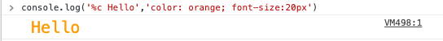
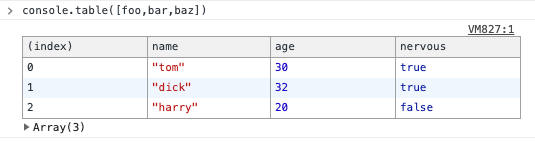
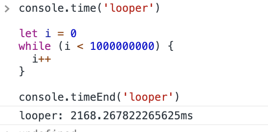

다들 자바스크립트 좋아하시나요? 저는 자바스크립트 정말 좋아합니다!

근데 자바스크립트를 쓰실때 어떻게 해서 쓰시나요? 그리고 혹시 더 자바스크립트에 대해 알고 싶지는 않으신가요? 전 더 알고 싶고 그렇습니다.

그렇게 해서 다들 아는 것이 보통 클로저와 호이스팅 같은 중요한 친구들입니다. 하지만 이번 포스팅은 조금 알면 신기한 문법을 위주로 하려합니다!

<!--more-->

---

## console

넵! 처음엔 콘솔 함수 입니다. 다들 많이들 사용하시나요? 전 정말정말 많이 씁니다. 간단하게 값 보기에도 좋아서 가장 많이 쓰는 함수 중에 하나입니다.

첫번째 입니다

##### console.log('%c ',css)

```javascript
console.log('%c Hello', 'color: orange; font-size:20px')
```

이 코드를 치시면 이런 식으로 나옵니다.



짠! 만약에 로그를 많이 쓰는 웹이 있고 그 로그간에 차이점을 보여주기에 더 좋을것 같네요!

다음엔 이 코드 입니다.

##### console.table()

```javascript
const foo = { name: 'tom', age: 30, nervous: true }
const bar = { name: 'dick', age: 32, nervous: true }
const baz = { name: 'harry', age: 20, nervous: false }
console.table([foo, bar, baz])
```

이렇게 코드를 치신다면 이러한 결과를 얻으실 수 있습니다.


넵 그럼 이것 왜에 성능을 확인 할 만한 코드는 없을까요? 넵 당연히 있습니다. 바로 time입니다!

##### console.time() & console.timeEnd()

```javascript
console.time('looper')

let i = 0
while (i < 1000000000) {
  i++
}

console.timeEnd('looper')
```



넵. time은 시간을 재주는 함수로서 선언을 할 때 이벤트 이름을 쓰시고 timeEnd시 선언 해주신 이벤트 이름을 쓰시면 time을 선언했을때 부터 timeEnd시 까지 시간을 재주어 성능을 보기에 용이합니다!

그리고 함수는 또한 함수 안에 함수 그리고 그 안에 함수를 쓰는 경우가 많습니다. 이때 쓰는 것이 바로 trace입니다

##### console.trace

```javascript
const hello = () => {
  console.trace('javascript')
}

const Awesome = () => {
  hello()
}

Awesome()
```

넵 결과는 이렇습니다!


이상으로 console이였습니다!

---

## Template Literal

넵 이번에 볼 것은 안 써본 사람은 있어도 한번만 써본 사람은 없다는 템플릿 리터럴입니다. 한번 바로 보실까요?

```javascript
const a = { name: 'Junghun', age: 25 }
console.log(`Hi! my name is ${a.name}, and i am ${a.age} years old!`)
```

네! 템플릿 스트링은 아시는 분들은 많이들 쓰고 있는 문법입니다. 사실 문자열들을 +로 연결하는 것은 가독성과 프로그래머의 에러를 유발하기 쉽습니다. 그래서 이렇게 하면 더욱 좋은 코드가 되는 것이죠! (참고로 object destructuring을 할 수는 있지만 일부러 하지 않았습니다.)

사실 이 코드는 많이들 아시고 사용하시는 코드입니다. 그럼 이건 어떠신가요?

```javascript
function HelloMachine(str, name, age) {
  const ageStr = age >= 25 ? '가망이 없어.' : '아직 괜찮아.'

  return `${str[0]}, 난 ${name}이야 ${ageStr}`
}

console.log(HelloMachine`안뇽안뇽 ${'정훈'} ${25}`)
```


넵 보시다시피 함수명 뒤에 ``를 붙이고 \${}한 것이 변수로서 들어가게 됩니다! 이렇게 스타일드 컴포넌트가 만들어져있지 않을까! 생각합니다.

---

이상으로 사람들이 많이 모르는! 자바스크립트의 문법을 알아보았습니다! 읽어주셔서 감사합니다!
