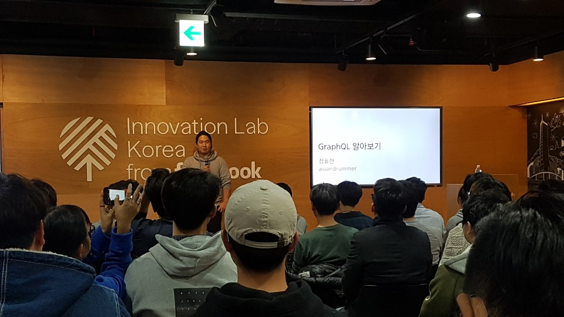

이번에 페이스북에서 그래프큐엘 알아보기라는 주제로 직접 페이스북의 컨트리뷰터 중에 한 분이 오셔서 강연해 주셨다.

###graphql의 배경
페이스북은 페이스북의 라이브러리를 이런식으로 사용중이다.

> react : ui 라이브러리 

> graphql : data fetch 라이브러리 

> relay : react와 graphql 엮어주는 라이브러리 

페이스북은 예전엔 데스크탑 웹이 우선적이었다. 하지만 이때 모바일은 안되는 기능들과 성능이 있었다.
이걸 고치기 위해 원래 html을 웹뷰로 보여준것과 달리 아예 네이티브 앱과 웹서버를 엮어줘야했다.

## <!--more-->

원래 rest api를 쓰려면 하나의 뷰를 불러오기 위해 여러번의 ajax요청등이 있어야한다.

그래프ql은 쿼리 랭귀지 rest api를 대체하는 개념

그래프 ql은 크게 3개로 정의 될 수 있다.

1. Mutation: 뮤테이션(읽고 쓰는것)
2. Query: 쿼리(읽는것)
3. Subscription: 서브스크립션(실시간 정보 구독)

---

###그래프 ql의 중심원리

1. Type System
   > graphql은 Strong type language 스키마와 같은 개념으로 가져온다
2. Composition
   > 프래그먼트 시스템 나눠서 쓸 수 가 있다.(Fragment)
   > 서버는 Capability가 있고 그에 맞게 클라이언트는 요청한다.
3. Backed by arbitrary code
4. Type System On Client
   > Introspection, a platform for building tools
   > Native Code Generation
   > Persisted Quaries
   > IDE Integration
5. Mutations
   > 데이터를 처리하고 가져옴 , 원래는 post,put같은걸로 요청후에 다시 또 겟 요청을 해야함

---

###페이스북이 써본 그래프 ql의 단점

1. 그래프큐엘은 빌트인 캐슁이 없음
2. 오버페칭(정보를 더 많이 요청), 언더페칭(정보를 적게 요청)
3. API 성능, 보안

---

###나중에 공부해야 할 것
콜로케이션 릴레이 나중에 찾아볼것
persist query
