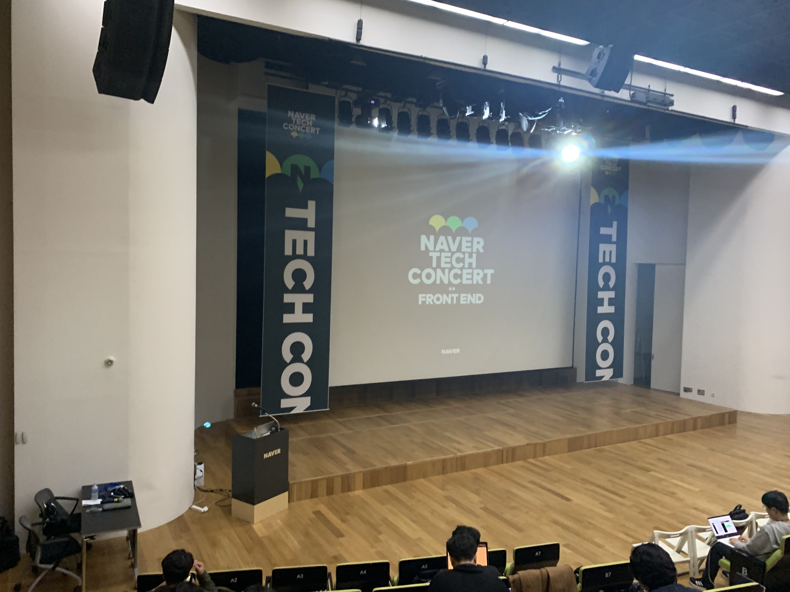

### 플랫폼 UI 개발 전략의 모든 것 - 이재용님

1. 플랫폼 UI 스펙 분석 전략
2. 모듈화 전략
3. 전처리기 전략

#### 스마트 에디터의 기존 설계의 문제점

에디터는 많은 곳에서 쓰는데 포스트 요구사항, 블로그 요구사항, 쇼핑 요구사항등이 에디터 공통 스타일로 들어가 코드관리가 힘들었다.

에디터의 UI 요소간 관계를 파악하기가 어려워 버그 및 사이드 이펙트 발생
플랫폼의 css와 서비스의 css의 간섭이 발생하고 스타일의 우선 순위 관리가 어려움

커스텀 및 확장을 고려하지 않았기 때문에 서비스의 요구사항을 파악하기 어려웠음

<!--more-->

#### 새로운 설계 방항 - 스마트 에디터 1

UI 공통화는 디자인 중심이 아닌 기능 중심으로 이뤄져야 한다.

> 구조를 먼저 파악하고 디자인은 스킨 개념으로 접근해야한다.

조건 및 상태에 따라 다른 스타일이 적용되어야한다.

> css는 정적인 언어지만 설계는 동적이어야 한다,

각기 다른요구사항을 빠르고 쉽게!

> 설정으로 분리하여 하나의 파일에서 모두 변경할 수 있게!

설계를 시작하기 전에...
css 방법론 & Css preprocessor

> 1.  BEM
> 2.  CMACSS
> 3.  OOCSS

css Preprocessor
css를 전처리하여 빠르고 쉽게 할 수 있고 복잡한 코드 작성을 쉽게 도와준ㄷ.

스마트 에디터 원은 2,3의 혼합
전처리기sass와 postcss를 이용함

#### 동적인 UI 스타일 로직

###### 컴포넌트 간격과 연관된 UI 스펙 분석과 구현

이미지를 특정하여 상황별로 다르게 한다. 이 때 상황마다 다르게 준다.
scss로 네스팅 하여 설명하는 것이 더 좋음

먼저 스펙 분석

1. 스펙정리

   > 인접한 컴포넌트에 따라 간격이 달라질 수 있다.
   > 간격과 같은 높이이 텍스트 추가 버튼이 필요하다.

2. 플랫폼 관점에서 설계 포인트
   > 컴포넌트 사이 간격은 서비스 별로 요구사항이 다를 수 있다.

그 다음 구현
@include 와 @mixin @each를 통해 동적으로 적용하여 할 수 있게 한다. 스타일을 동적화!

모듈화는 디자인 보다 각가의 요소가 하는 일에 집중하고 최소화하는 것이 코드관리가 용이함

지속적인 리팩토링이 필요함
그리고 리팩토링은 반복되는 코드를 줄이는 것이 중요하다.

---

### 빠르게 훑어보는 웹 개발 트렌드 - 한장현님

#### 그동안의 웹의 역사

웹 개발은 서버중심 클라이언트 중심 고도화 순으로 발전을 해왔다.

1. 서버중심
   처음에 서버를 중심으로 개발이 이루어졌다.
   1998년도 이전에는 이미 만들어진 정적페이지를 그냥 주는 식혹은 서버에서 만든 웹페이지를 주는 형식으로 개발이 되었었다.

2. 클라이언트 중심
   이때는 서버에서 <b>페이지 단위</b>로 생성하여 제공을 하였다.
   1999년 이후로 ajax가 나온 후 페이지는 부분적으로 갱신, 서버는 API 역할에 집중을 하였다.
   즉 돔을 직접적으로 건드리는 JQuery가 게임체인저 역할을 하였다.

이 클라이언트 중심 개발은 클라이언트가 주도적으로 요청하여서 이미 화면에 떠있는 페이지 부분에 추가하고 DOM에 적극적으로 개입

3. 고도화

자바스크립트를 이미 만들어진 걸 쓰기 힘드니 npm이 등장하여 더욱 쉽게 설치
css를 고도화 하기 위해 전처리css가 쓰이기 시작했다.
그리고 nodejs가 등장하면서 서버도 자바스크립트로 쓸 수 있게 되었다.

복잡해지는 프론트엔드 로직을 체계적으로 관리하기 위해 <b>프레임워크, 라이브러리</b>를 적극적으로 사용

4. +alpha

   웹 기술로 네이티브 앱! => 폰갭, 네이티브 스크립트, 리액트 네이티브
   오프라인 일때도 실행되게 하자! => PWA(Service Worker)
   웹 앱을 데스크탑에 설치하자! Node-webkit, Electron

#### 요즘 웹개발

1. 프레임워크, 라이브러리 적극 활용
   > 리액트 앵귤러 뷰(자바스크립트 프레임워크, 라이브러리)와 부트스트랩 마테리얼 클래리티 스타일 프레임워크
   > 그리고 추가적인 로대쉬, 스타일러스, PWA등등...
2. 컴포넌트 기반
   > 템플릿, 스타일, 로직을 하나의 컴포넌트로 묶어서 관리
   > 그리고 이것을 빌드를 함 이것은 js, css로 나옴
   > 이를 웹브라우저에서 실행!
3. 태스크러너/ CLI 사용
   > cra, vue-cli 등등 사용

#### 공부하면 좋은 것들

1. 기본 지식

   > 레이아웃 구성 - HTML(HTML5) 
   > 스타일 지정 - CSS(CSS3&flex), 스타일 라이브러리(부트스트랩,마테리얼), 전처리기 
   > 로직처리 - Javascript, ES6, TypeScript, 프레임워크

2. 개발 툴
   > Git, GitHub
3. UI, UX, 디자인 시스템
4. 데이터 시각화
   > 어떤 데이터를 어떤식으로 표현하는 것이 효과적인 것인가.

#### 정리

1. 프론트엔드 개발 트렌드는 빠르게 변한다. 계속 찾아보고 공부해야 한다.
2. 풀스택에는 물리적인 한계가 존재한다. 전문분야를 선택한는 것이 효율적일 수 있다.

---

### 총평

다른 강의들도 진짜 너무 좋았고 네이버 콘서트 홀자체도 너무 이뻤다. 다른 강의들도 다 적고 싶었지만 오히려 이건 듣고 공감하는 것이 더 좋은 생각이라 나머지 강의는 피처 적지 못했다. 이외에도 네이버 계열사에서 간단하게 취업 설명회도 해서 너무 좋았다. 진짜 채용이 안되더라도 핵데이에 갈 수 있다면 좋겠다고 더더욱 생각이 들었다.
