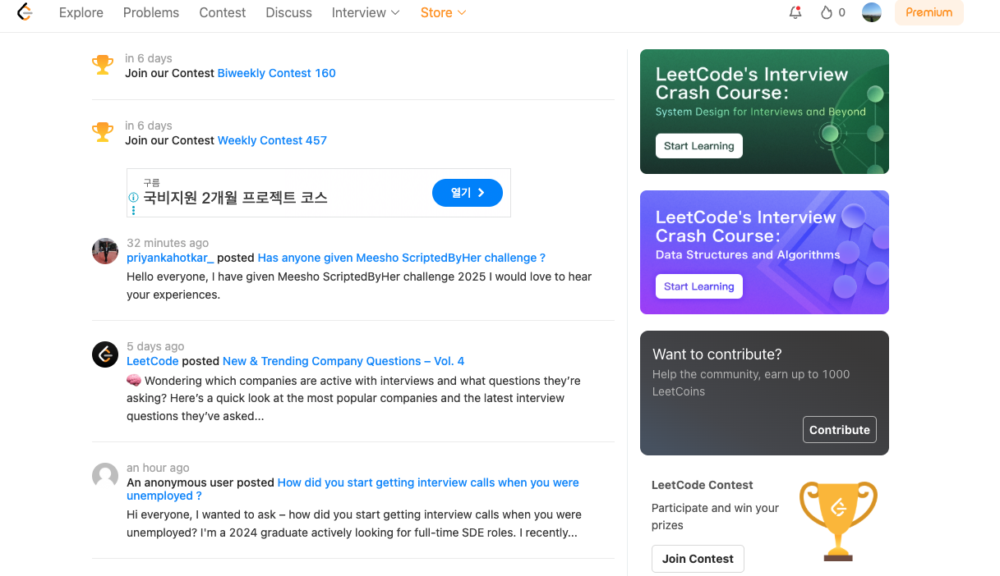
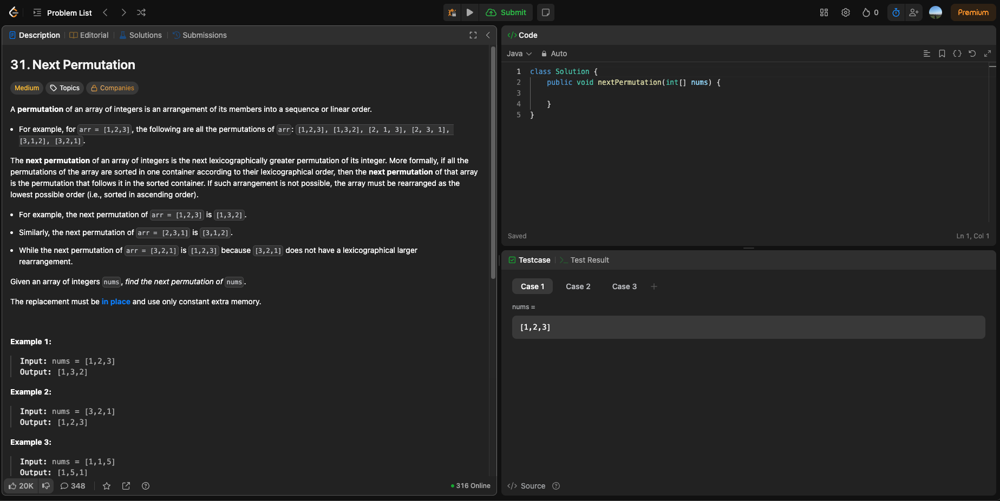
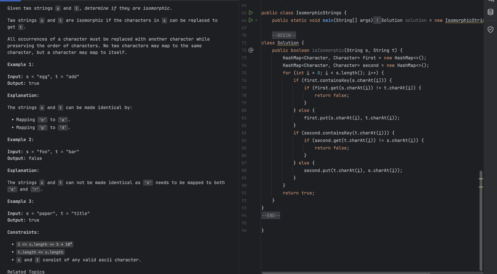
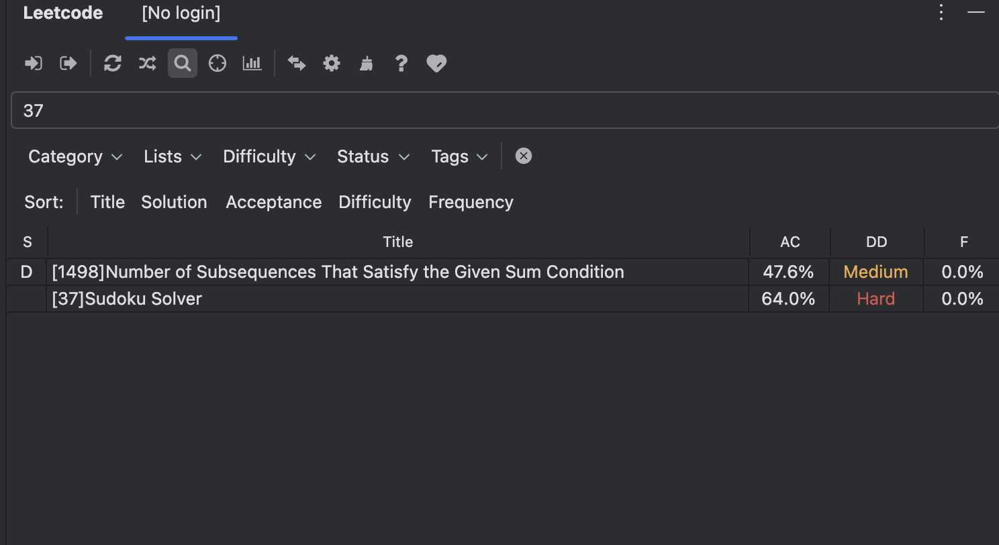
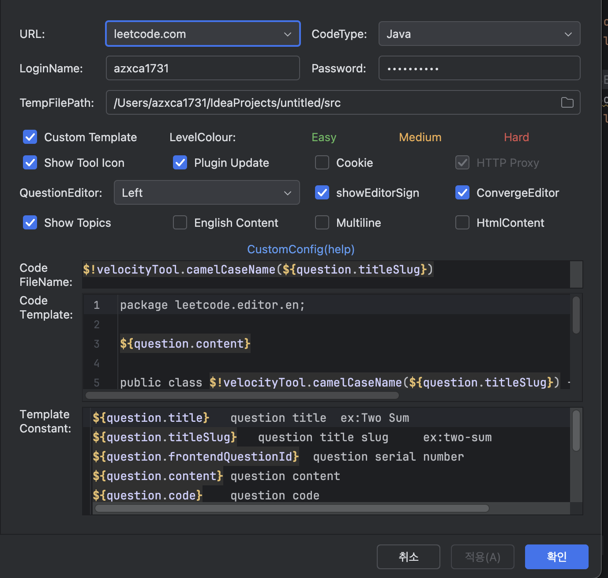
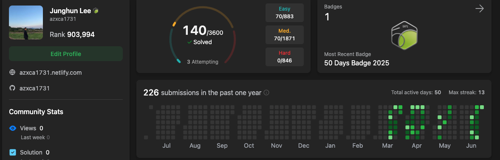

## Leetcode란?
다들 이름은 들어봤을 것이다! Leetcode
리트코드란 알고리즘 사이트로서, 많은 문제와 영어로 되어있어서 경력직 코테에 많은 도움이 된다.
왜냐? 많은 곳이 영어로서 알고리즘 테스트를 보기때문이다...
그리고 이미 백준은 아이디가 많은 문제를 풀었어서 새로운 유형의 문제를 정복해보고 싶다는 생각에 도전하게 되었다.



## 어떤 식으로 풀까?

리트코드는 다음과 같이 왼쪽의 문제와 코드를 작성할 수 있는 공간이 있다.
다만 디버깅과 자바 유저들이라면 당연시 여기는 자동완성, auto import등이 원활하게 지원이 되지 않는다.
그렇기에 나는 IDE에서 풀고 복붙을 해서 넣자! 라는 생각을 하게 된다.
하지만 그렇기엔 무언가... 무언가... 누군가가 툴을 만들어 놓지 않았을까? 라는 생각을 하게 되었다.

## Leetcode plugin - LeetCode Editor
그렇게 나는 플러그인을 찾아보았고 결국 찾았다. LeetCode Editor라는 플러그인을 말이다. 
<!--more-->



이렇게 한다면 문제 검색, 제출, 설명을 인텔리제이안에서 끝낼 수 있으며, 기존의 IDEA의 기능을 100% 다 활용하여 사용할 수 있다. 이 방법을 어떻게 세팅을 할지에 대해서 쉐어링 하도록 하겠다.
현재의 LeetCode Editor의 버전은 8.14이며, 시간이 지난 이후에 해당 세팅이 안될 수 있으니 참고해주길 바란다.

## 세팅값 공유

URL은 중국어를 잘하지 못한다면 leetcode.com을 설정한다.
그리고 중요한 부분은 다음과 같다

Code FileName
```
$!velocityTool.camelCaseName(${question.titleSlug})
```
Code Template
```
package leetcode.editor.en;

${question.content}

public class $!velocityTool.camelCaseName(${question.titleSlug}) {
    public static void main(String[] args) {
        Solution solution = new $!velocityTool.camelCaseName(${question.titleSlug})().new Solution();
    }
    
    ${question.code}
}
```

이런식으로 하면 단순히 딸깍 딸깍 몇번이면, 내가 원하는 문제를 찾기만 하면 바로 IDEA에서 코드를 짜고 디버깅까지 할 수 있으며, 제출까지 한번에 되는 최적화 솔루션이 된다. 
그리고 Custom Template 버튼을 누를때 QR코드가 뜬다. 여기서 <b>굳이 도네이션 하지 않아도 확인 버튼만 누르면 사용할 수 있으니 참고하자</b>

## 그래서 현재 어느정도 진행했을까?

나는 현재 140문제정도 풀었고, 가능하면 하루에 한문제씩 풀려고 한다! 언젠가 파파팟 하면서 다 풀 수 있는 그날을 위해 우리 모두 화이팅하자!