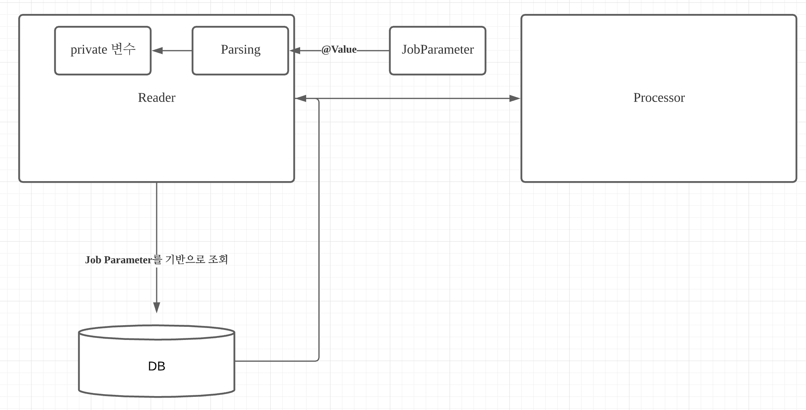
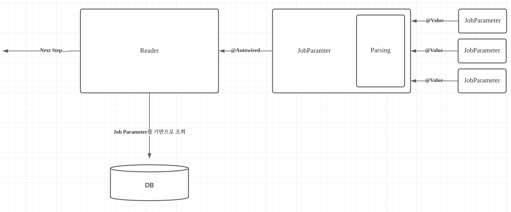
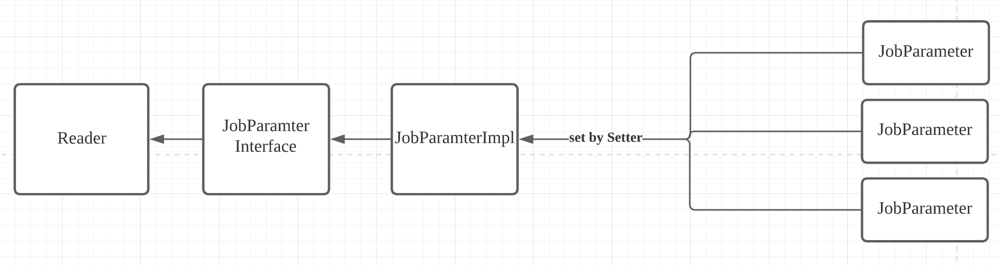

## 난 왜 스프링 배치를 손보게 되었을까

저번년도에 취직을 하고 열심히 일을 하고 있던 중, 보안사항을 안전하게 처리하기 위하여 배치에 투입이 되었던 적이 있다.
이미 구현이 되어있는 배치였고 나는 거기에 숟가락을 얹는 정도의 기여를 하였다. 그리고 요즘 팀에서 돌리는 배치의 수정 사항이 필요하여
예전에 숟가락만 끼얹은 다른 분이 만든 배치가 생각이 났다. 해당 배치처럼 더 좋은 배치를 만들어 팀에 기여하고 싶었다.

### 스프링 배치의 기본적인 구조

스프링 배치란 우선 다른 분들(감사합니다 jojoldu님..!)이 설명을 해주셨겠지만 스프링 진영에서 만든 대규모 배치 작업에서 쓰이는 툴이다.
이 스프링 배치에서는 기본적으로 잡이라는 큰 단위로 실행을 한다. 그리고 잡 밑에 스텝이라는 단위가 있으며 이 스텝 밑에 태스클릿, 그리고 이 태스클릿을 하나의 태스클릿으로 작성하거나, 리더, 프로세서, 라이터로 나누어서 구성한다. 이 중에서 내가 이번에 건드린 곳은 리더 부분이였다.

<!--more-->

### ASIS의 구조

우선 우리 팀의 해당 배치를 보자.  

우선 내가 손대기까지 전에 잡 파라미터가 하나로 주입이 되고 있었고 이를 기반으로 어떤 대상을 타게팅하여 작업을 수행할 지 결정을 한다.
이 과정에서 잡 파라미터 기반의 서비스 호출이 있고, 이를 확인하기 위해 테스트 코드가 있었지만, private한 변수(잡 파라미터)를 직접 리플렉션을 이용하여 수정을 하는 방식이 몹시 마음에 들지 않았다.
더불어 내가 수정할 방식은 추가적인 파라미터가 2개, 추가적인 서비스 호출이 2개가 더 예정되어 있어 이는 도저히 좋은 구조라 보기 힘들었다.
이 잡파라미터를 디비에 액세스 할 수 있게 만드는 주요 역할까지 모두 리더가 역할을 책임지고 있었으므로 더이상 좋은 구조라 보기 너무 힘들었다.

그래서 난 아예 잡파라미터만을 위한 클래스를 만들고, 잡파라미터에 대한 주입과 기본적인 파라미터 파싱을 맡기게 되었다.

### TOBE의 구조

리더는 본래의 역할인 디비에서 타겟을 가져오는 것으로만 확정짓는다. ~~사실 추가적인 역할이 있긴하나 여기선 이렇게...~~
그리고 그동안 부가적으로 했던 모든 파라미터 관련을 잡파라미터라는 클래스가 책임지게 만들고 이렇게 클래스가 분리되어 더욱 테스트 코드는 간결해진다.
그동안 했던 private 변수를 강제로 바꾸는 역할을 안해도 되었고, 모킹을 이용해 원하는 값을 받을 수 있게 수정하여 더욱 깔끔한 구조를 가지게 하였다.

이렇게 끝났으면 좋았을 텐데.... 내 생각과 다르게 빈은 주입되지 않았다....

## 빈의 스콥 범위와 JobParameter 주입시기

빈을 생성을 할 때, 우리는 스콥범위를 정한다. 기본적인 이야기이다. 이 스콥범위로는 가장 유명한 것이 대부분의 빈을 생성할 때 쓰는 싱글턴, 요청때 마다 만드는 리퀘스트 이렇게 말이다. 그리고 난 이것을 하면서 스콥의 새로운 범위를 알았다. 바로 step 스콥이다.
이 스텝 스콥에 있어야지만 JobParameter를 주입 받을 수 있었고, 그동안 태스클릿을 구성하던 빈들도 step 스콥으로 만들어졌다. 그리고 내가 만들 빈은 아무생각 없이 만들었기에 싱글턴으로 만들어졌었고, 파라미터를 주입받지 못하면서, 빈이 제대로 뜨지 못하는 효과를 만들어 버렸다.

그리고 이 스텝 스콥으로 만들 때, 리퀘스트 스콥과 같이 우선적으로 프록시 빈이 있어야했고, 이를 JDKDynamicAopProxy라는 클래스가 우선적으로 시작시에 연결해주고 스텝 스콥으로 들어옴과 동시에 빈을 생성해주고 그 빈에다가 잡파라미터를 주입을 해주는 것이었다. 이를 위해 내가 한 것은 다음과 같다.

홀더와 같은 역할로 인터페이스를 도입했다.그리고 해당 빈의 생성을 Reader가 생성될 때, No Args로 하게 만들었다. 그리고 파라미터 주입은 스프링의 주입방법 중의 하나인 setter를 통하여 주입하게끔 설정 하였다.

### 깨달은 점

이제 2년차 백엔드 프로그래머가 되었는데 하면 할 수록 모르는 것이 많다라는 것을 깨닫는다.
우리가 당연시 여기던 것을 알고보면 제대로 모르는 것이 아닌가 확인을 한번 해보는 것도 좋다고 생각한다!
그리고 이것 이외에 나중에 말하겠지만, 또다른 문제가 발생한다 그것은 바로 In Query와 QueryDSL의 통합이다. 이 부분은 다음번에 마저 포스팅 하도록 하겠다.
