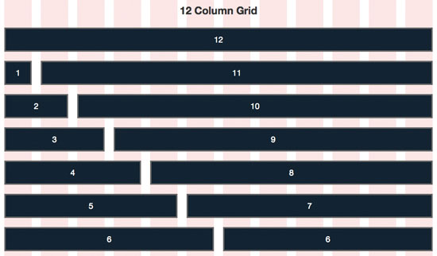
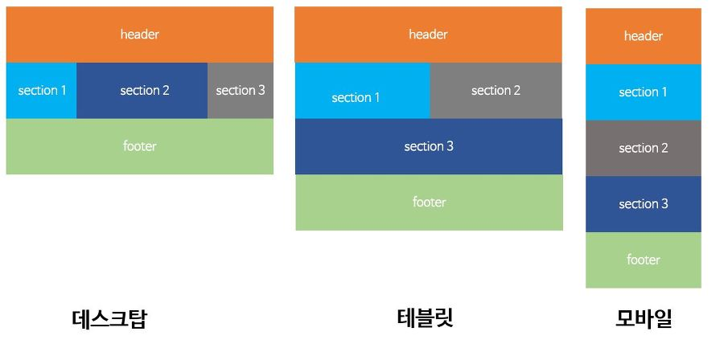
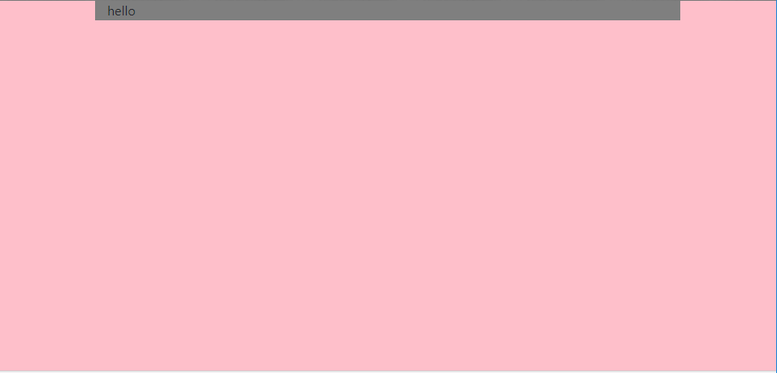
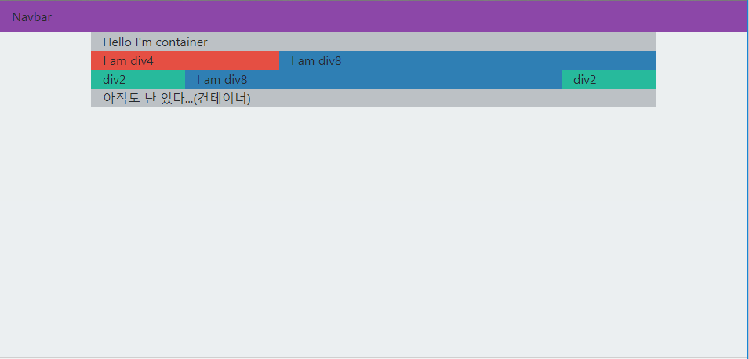
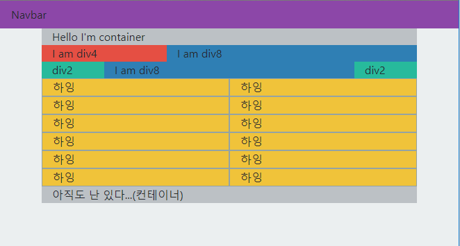
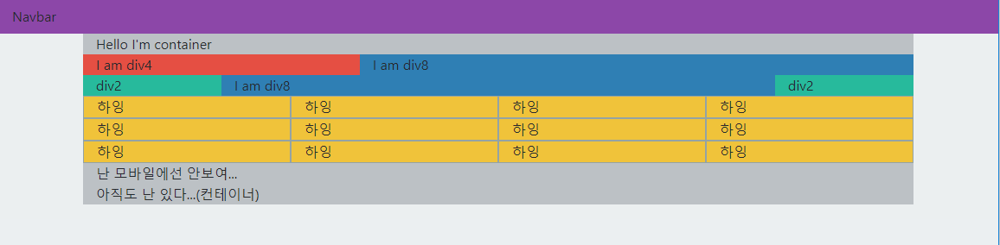
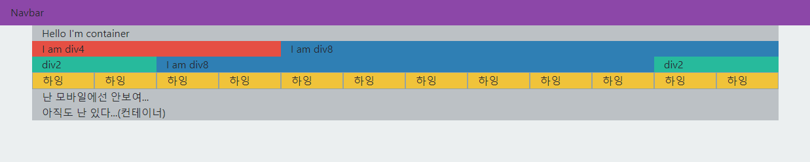

안녕하세요! 이번엔 부트스트랩에 대하여 알아보겠습니다. 부트스트랩은 css,html,js 프레임워크입니다. 제가 우선적으로 설명할 것은 그리드 레이아웃과 그것을 사용할 수 있게 해주는 몇가지를 소개시켜드리려 합니다. 순서는 그리드 레이아웃, 컨테이너와 컬럼과 로우, 반응형 키워드 순으로 진행됩니다.

<!--more-->

---

### 그리드 시스템

부트스트랩의 그리드 시스템을 간단하게 보자면 12개로 나눠서 하는 걸 의미하는데요 이해를 돕기 위해 먼저 어떻게 되는지 보겠습니다.



이런식으로 12가지로 나눠서 하게 되는겁니다. 즉 화면을 12개로 세로로 나누어져 마크업 할 수 있게 됩니다. 이 그리드 시스템은 반응형 웹에 정말 많은 도움이 되는데요 그 예시를 보면서 이야기 할까요?



위와 같이 상황 또는 뷰포트 별로 보이는 것을 다르게 할 수 있고 또한 빠르게 할 수 있습니다. 이 그리드 시스템을 쉽게 사용할 수 있는 클래스들을 보면서 마저 이야기 하겠습니다.

---

### 컨테이너와 컬럼과 로우

맨 처음으로 이야기 드릴 클래스는 컨테이너입니다. 컨테이너는 가운데로 모으는 역할을 하고 내용이 딱 가운데로 올 수 있게 해줍니다. 마치 이 블로그 처럼 말이죠. 예시를 보면서 이야기 할까요?



```html
<!DOCTYPE html>
<html>
  <head>
    <link
      rel="stylesheet"
      href="https://stackpath.bootstrapcdn.com/bootstrap/4.2.1/css/bootstrap.min.css"
    />
    <style>
      body {
        height: 100vh;
        background-color: pink;
      }
      .container {
        background-color: gray;
      }
    </style>
  </head>
  <body>
    <div class="container">hello</div>
  </body>
</html>
```

이런식으로 부트스트랩은 class만 바꿔서 바로 쓸 수가 있습니다. 이게 생산성으로 이어집니다! 정말 편하죠. 그리고 위와 같이 다른 건 필요없고 저런식으로 CDN을 통해서 바로 사용할 수 있습니다.

다시 본론으로 돌아와 컨테이너는 이런식으로 작동하게 됩니다.

그럼 마저 콜론과 로우에 대해서 봅시다. 이것도 위 처럼 예제로 진행됩니다.

```html
<!DOCTYPE html>
<html>
  <head>
    <link
      rel="stylesheet"
      href="https://stackpath.bootstrapcdn.com/bootstrap/4.2.1/css/bootstrap.min.css"
      integrity="sha384-GJzZqFGwb1QTTN6wy59ffF1BuGJpLSa9DkKMp0DgiMDm4iYMj70gZWKYbI706tWS"
      crossorigin="anonymous"
    />
    <style>
      body {
        height: 100vh;
        background-color: #ecf0f1;
      }
      .navbar {
        background-color: #8e44ad;
      }
      .container {
        background-color: #bdc3c7;
      }
      .div_2 {
        background-color: #1abc9c;
      }
      .div_4 {
        background-color: #e74c3c;
      }
      .div_8 {
        background-color: #2980b9;
      }
    </style>
  </head>
  <body>
    <div class="navbar">Navbar</div>
    <div class="container">
      Hello I'm container
      <div class="row">
        <div class="col-4 div_4">I am div4</div>
        <div class="col-8 div_8">I am div8</div>
      </div>
      <div class="row">
        <div class="col-2 div_2">div2</div>
        <div class="col-8 div_8">I am div8</div>
        <div class="col-2 div_2">div2</div>
      </div>
      아직도 난 있다...(컨테이너)
    </div>
  </body>
</html>
```



이처럼 col 뒤에 간단히 숫자 (1~12)를 넣는 것으로 얼마만큼 차지 할 것인가 쉽게 정할 수 있게 됩니다. 정말 편하죠? 하지만 이것과 같이 알면 더 좋은 기능이 있습니다. 바로 반응형 키워드 입니다.

---

### 반응형 키워드

반응형 키워드는 뷰포트에 기인합니다. 이렇게 말하면 좀 어려우니 쉽게 말하자면 어떤 화면으로 보는가에 따라 다르게 보여지는겁니다. 이걸 부트스트랩은 키워드화 시켰는데 이 키워드는 다음과 같습니다.

1. 미지정(기본 혹은 xs) ~576px (모바일)
2. sm 576px~768px (모바일)
3. md 768px~962px (태블릿)
4. lg 962px~1200px (태블릿,데스크탑)
5. xl 1200px~ (데스크탑)

그럼 이 키워드는 어디에 쓰일까요?
밑과 같이 쓰면 정말 강력하게 쓸 수 있습니다.

```html
<!DOCTYPE html>
<html>
  <head>
    <link
      rel="stylesheet"
      href="https://stackpath.bootstrapcdn.com/bootstrap/4.2.1/css/bootstrap.min.css"
      integrity="sha384-GJzZqFGwb1QTTN6wy59ffF1BuGJpLSa9DkKMp0DgiMDm4iYMj70gZWKYbI706tWS"
      crossorigin="anonymous"
    />
    <style>
      body {
        height: 100vh;
        background-color: #ecf0f1;
      }
      .navbar {
        background-color: #8e44ad;
      }
      .container {
        background-color: #bdc3c7;
      }
      .div_2 {
        background-color: #1abc9c;
      }
      .div_4 {
        background-color: #e74c3c;
      }
      .div_8 {
        background-color: #2980b9;
      }
      .reactive {
        background-color: #f1c40f;
        border: 1px solid #95a5a6;
      }
    </style>
  </head>
  <body>
    <div class="navbar">Navbar</div>
    <div class="container">
      Hello I'm container
      <div class="row">
        <div class="col-4 div_4">I am div4</div>
        <div class="col-8 div_8">I am div8</div>
      </div>
      <div class="row">
        <div class="col-2 div_2">div2</div>
        <div class="col-8 div_8">I am div8</div>
        <div class="col-2 div_2">div2</div>
      </div>
      <div class="row">
        <div class="col-12 col-sm-6 col-md-4 col-lg-3 col-xl-1 reactive">
          하잉
        </div>
        <div class="col-12 col-sm-6 col-md-4 col-lg-3 col-xl-1 reactive">
          하잉
        </div>
        <div class="col-12 col-sm-6 col-md-4 col-lg-3 col-xl-1 reactive">
          하잉
        </div>
        <div class="col-12 col-sm-6 col-md-4 col-lg-3 col-xl-1 reactive">
          하잉
        </div>
        <div class="col-12 col-sm-6 col-md-4 col-lg-3 col-xl-1 reactive">
          하잉
        </div>
        <div class="col-12 col-sm-6 col-md-4 col-lg-3 col-xl-1 reactive">
          하잉
        </div>
        <div class="col-12 col-sm-6 col-md-4 col-lg-3 col-xl-1 reactive">
          하잉
        </div>
        <div class="col-12 col-sm-6 col-md-4 col-lg-3 col-xl-1 reactive">
          하잉
        </div>
        <div class="col-12 col-sm-6 col-md-4 col-lg-3 col-xl-1 reactive">
          하잉
        </div>
        <div class="col-12 col-sm-6 col-md-4 col-lg-3 col-xl-1 reactive">
          하잉
        </div>
        <div class="col-12 col-sm-6 col-md-4 col-lg-3 col-xl-1 reactive">
          하잉
        </div>
        <div class="col-12 col-sm-6 col-md-4 col-lg-3 col-xl-1 reactive">
          하잉
        </div>
      </div>
      <div class="d-none d-md-block">난 모바일에선 안보여...</div>
      아직도 난 있다...(컨테이너)
    </div>
  </body>
</html>
```





이처럼 보이는 화면에 따라 다르게 보이게 됩니다.
정말 신기하죠?
그리고 자세히 보시면 하나 말씀안드린 키워드가 있는데 그건 다음에 마져 이야기해드리도록 하겠습니다!
이상 부트스트랩 그리드 시스템이였습니다!
